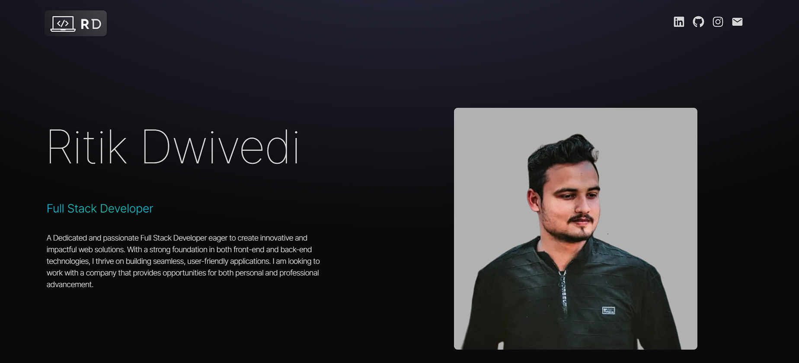
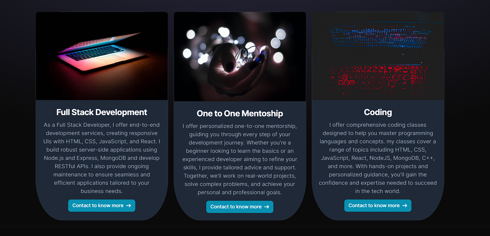
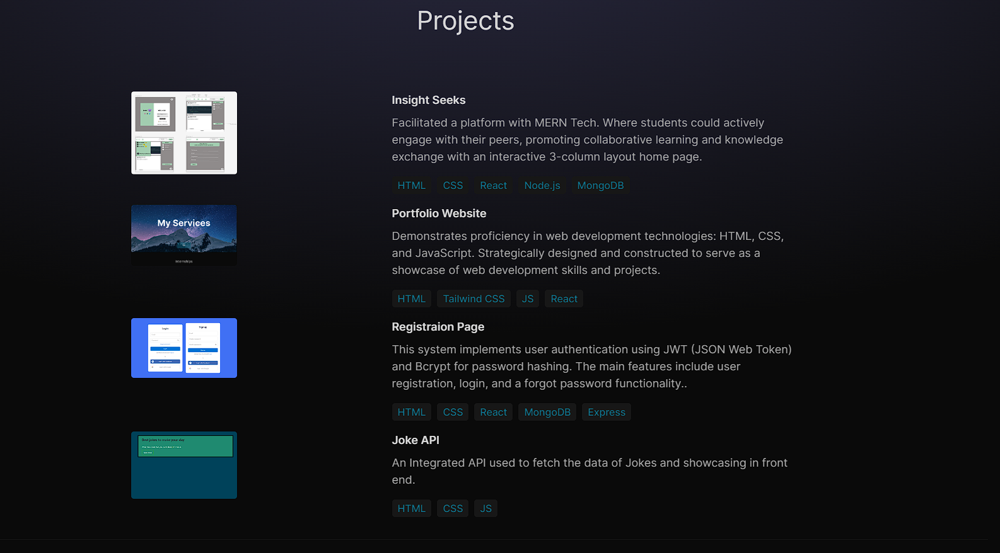
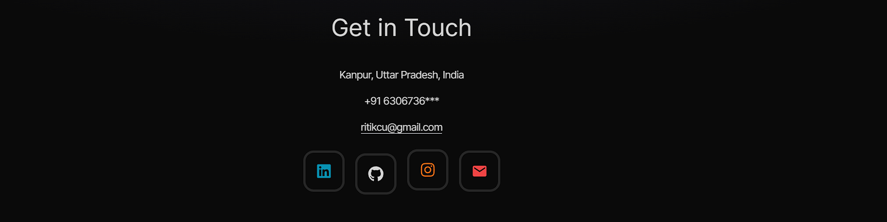

# React + Vite

This template provides a minimal setup to get React working in Vite with HMR and some ESLint rules.

# Project Title

Welcome to the project repository. This project is built using React, Vite, and Tailwind CSS. Below is an overview of the different sections of the project.

---

## About

<!-- Full width image for About section -->

This section provides an overview of the project, its goals, and the technologies used. 

---

## My Services

<!-- Full width image for My Services section -->

In this section, you will find details about the services offered. It includes a parallel scroll effect to enhance user experience.

---

## Internships

## Projects

<!-- Full width image for Projects section -->

Here you will find a showcase of the projects worked on. Each project includes a brief description, technologies used, and outcomes.

---

## Get in Touch

<!-- Full width image for Get in Touch section -->

Feel free to reach out for any queries or collaborations. This section includes contact details and links to social media profiles.

---

Thank you for visiting the project repository. We hope you find the information helpful.
